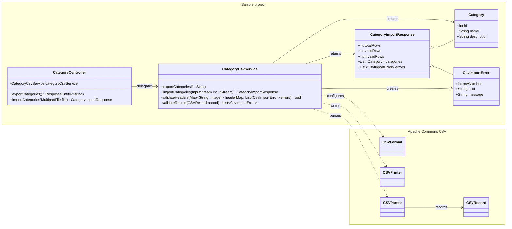
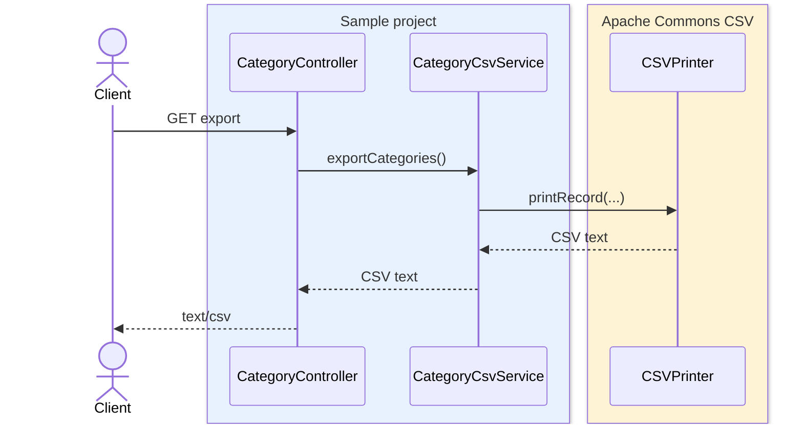
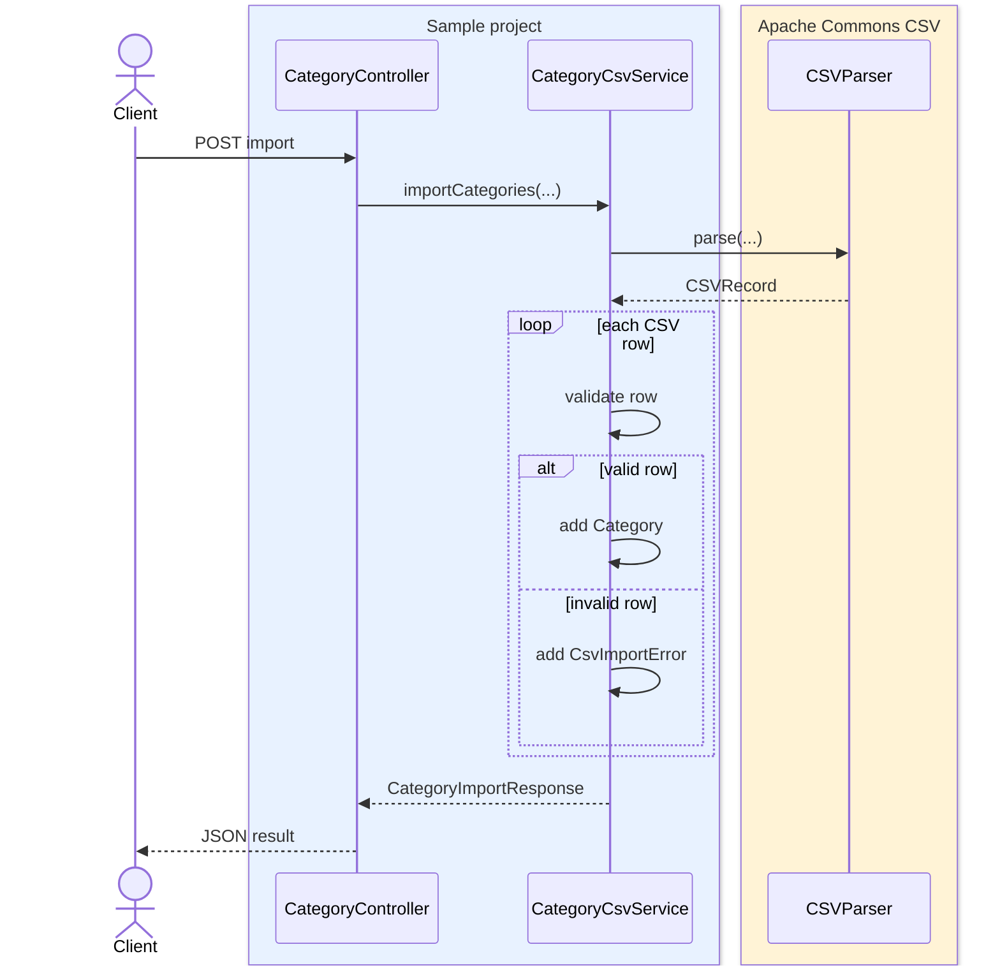

# Apache Commons CSV Spring Boot API

Spring Boot + Apache Commons CSV で CSV export/import API を実装するサンプルです。

## 内容

- `GET /categories/export` でカテゴリ一覧を CSV として返す
- `POST /categories/import` で multipart の CSV ファイルを受け取る
- Apache Commons CSV でヘッダー付き CSV を出力・パースする
- import 結果として、正常行と基本バリデーションエラーを JSON で返す
- `MockMvc` で export/import API の挙動を確認する

## 構成

- `CategoryController`: `/categories/export` と `/categories/import` を公開する REST API
- `CategoryCsvService`: Apache Commons CSV を使って CSV の出力、パース、基本バリデーションを行う
- `Category`: CSV の正常行として扱うカテゴリデータ
- `CategoryImportResponse`: import 結果の件数、正常行、エラー一覧を返すレスポンス
- `CsvImportError`: CSV の行番号、フィールド名、エラー内容を表す
- `CSVFormat` / `CSVPrinter` / `CSVParser` / `CSVRecord`: Apache Commons CSV が提供する CSV 操作用クラス



## 処理の流れ

### Export



### Import



## Run Application

```bash
./gradlew bootRun -PspringBootVersion=3.5.14
```

起動後、`http://localhost:8080` で API を確認できます。

## API

### Export

```bash
curl -OJ http://localhost:8080/categories/export
```

レスポンスは `text/csv` で、`categories.csv` としてダウンロードできます。

### Import

```bash
curl -F file=@categories.csv http://localhost:8080/categories/import
```

CSV は次のヘッダーを想定します。

```csv
id,name,description
1,Books,Books and magazines
```

`id` は正の整数、`name` は空文字不可として検証します。

## Run Tests

```bash
./gradlew test -PspringBootVersion=3.5.14
./gradlew test -PspringBootVersion=4.0.6
./gradlew test -PspringBootVersion=4.1.0
```

GitHub Actionsでは、Gradle wrapper 9.5.1を使ってSpring Boot 3.5.14 / 4.0.6 / 4.1.0 と Java 17 / 21 / 25 の組み合わせでテストします。
